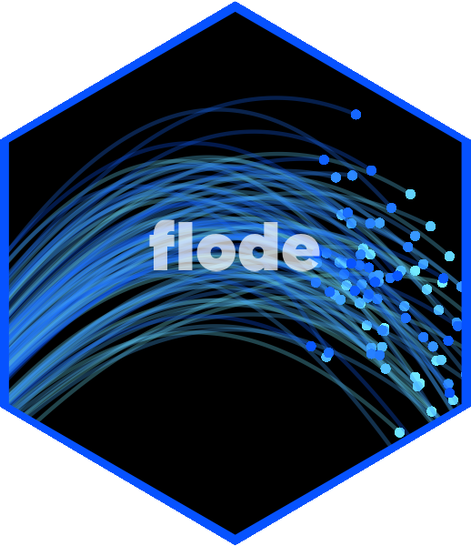

<!-- README.md is generated from README.Rmd. Please edit that file -->

```{r, include = FALSE}
knitr::opts_chunk$set(
  collapse = TRUE,
  comment = "#>",
  fig.path = "man/figures/README-",
  out.width = "100%"
)
```

# flode 

<!-- badges: start -->
[](https://cran.r-project.org/web/licenses/GNU%20General%20Public%20License) [](https://github.com/JonPayneEA/riskyData)
[](https://github.com/JonPayneEA/riskyData/commits/main)
<!-- badges: end -->

The goal of flode is to ...

## Installation

You can install the development version of flode from [GitHub](https://github.com/) with:

``` r
# install.packages("devtools")
devtools::install_github("JonPayneEA/flode")
```

## Example

This is a basic example which shows you how to solve a common problem:

```{r example}
library(flode)
## basic example code
```


