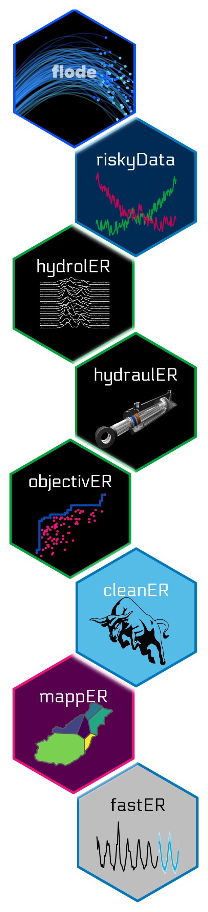

<!-- README.md is generated from README.Rmd. Please edit that file -->

```{r, include = FALSE}
knitr::opts_chunk$set(
  collapse = TRUE,
  comment = "#>",
  fig.path = "man/figures/README-",
  out.width = "100%"
)
```

# flode 

<!-- badges: start -->

[](https://cran.r-project.org/web/licenses/GNU%20General%20Public%20License) [](https://github.com/JonPayneEA/riskyData) [](https://github.com/JonPayneEA/riskyData/commits/main)

<!-- badges: end -->

The goal of `flode` is to provide a tools that work together that improve the modellingg workflows required in developing and maintainingg forecast models

## Installation

You can install the development version of flode from [GitHub](https://github.com/) with:

``` r
# install.packages("devtools")
devtools::install_github("JonPayneEA/flode")
```

## Usage

`library(flode)` will load the core flode packages:

```{r example}
library(flode)
## basic example code
```

## Packages available

::: {style="float:left;position: relative;"}

:::

<br/><br/>\
[flode](https://jonpayneea.github.io/riskyData/) for loading the range of packages
<br/><br/>
<br/><br/>
[riskyData](https://jonpayneea.github.io/riskyData/) for handling hydrometric data import\
<br/><br/>
<br/><br/>
[hydrolER](https://jonpayneea.github.io/riskyData/) for carrying out hydrological analyses\
<br/><br/>
<br/><br/>
[hydraulER](https://jonpayneea.github.io/riskyData/) carries out analyses of hydraulic data\
<br/><br/>
<br/><br/>
[objectivER](https://jonpayneea.github.io/riskyData/) provides a range of model performance metrics\
<br/><br/>\
[cleanER](https://jonpayneea.github.io/riskyData/) for data cleaning tools\
<br/><br/>
<br/><br/>
[mappER](https://jonpayneea.github.io/riskyData/) for supplying all your mapping needs in forecasting\
<br/><br/>
<br/><br/>
[fastER](https://jonpayneea.github.io/riskyData/) supercharged functions to speed up work

