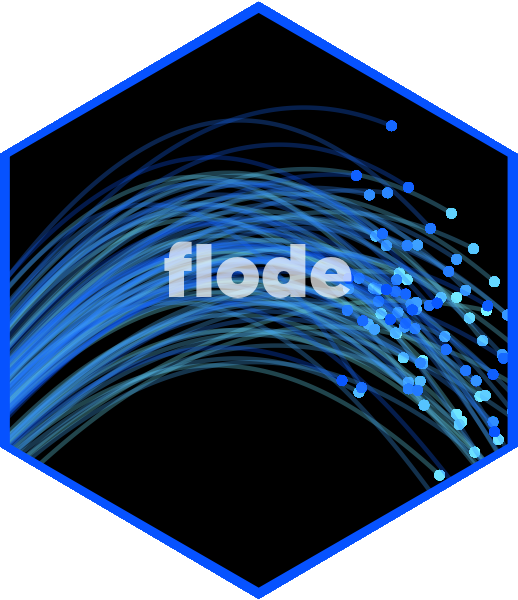

# flode 

<!-- badges: start -->
[](https://lifecycle.r-lib.org/articles/stages.html#experimental)
[](https://github.com/JonPayneEA/flode/actions/workflows/R-CMD-check.yaml)
<!-- badges: end -->

## Overview

`flode` is a meta-package for flood forecasting and hydrometric data analysis. Installing and loading `flode` gives you access to the complete suite of **reaches** sub-packages in a single call.

```r
library(flode)
```

---

## The reaches ecosystem

| Sub-package | Contents |
|---|---|
| [`reach.utils`](https://github.com/JonPayneEA/reach.utils) | Datetime helpers, config loading, logging |
| [`reach.io`](https://github.com/JonPayneEA/reach.io) | APIs, Gauge CSV, Parquet, netCDF read/write |
| [`reach.hydro`](https://github.com/JonPayneEA/reach.hydro) | Flow statistics, unit conversion, flood peaks |
| [`reach.ensemble`](https://github.com/JonPayneEA/reach.ensemble) | Quantile extraction, member weighting, exceedance probability |
| [`reach.validate`](https://github.com/JonPayneEA/reach.validate) | NSE, KGE, PBIAS, RMSE validation metrics |
| [`reach.viz`](https://github.com/JonPayneEA/reach.viz) | `theme_flode()`, flow series and ensemble fan plots |

---

## Installation

Install `flode` and all sub-packages from GitHub:

```r
# install.packages("remotes")
remotes::install_github("JonPayneEA/flode")
```

Sub-packages can also be installed individually:

```r
remotes::install_github("JonPayneEA/reach.io")
remotes::install_github("JonPayneEA/reach.hydro")
remotes::install_github("JonPayneEA/reach.utils")
remotes::install_github("JonPayneEA/reach.ensemble")
remotes::install_github("JonPayneEA/reach.validate")
remotes::install_github("JonPayneEA/reach.viz")
```

---

## Usage

```r
library(flode)
#> ── Attaching reaches packages ──────────────────────── flode 0.2.0 ──
#> ✔ reach.utils    0.1.0     ✔ reach.ensemble  0.1.0
#> ✔ reach.io       0.1.0     ✔ reach.validate  0.1.0
#> ✔ reach.hydro    0.1.0     ✔ reach.viz       0.1.0
```

### Check installed versions

```r
flode_versions()
```

### Update all sub-packages

```r
flode_update()
```

---

## Design principles

- **Consistent interfaces** — all reach packages follow the same bronze-schema data model
- **Pipeline-ready** — designed for operational EA Hydrometric Data Framework workflows
- **Parallel-first** — heavy I/O operations are parallelised where possible via `future` / `future.apply`
- **Tidy-compatible** — outputs are data.table friendly

---

## Contributing

This package is maintained by the Environment Agency Forecasting and Warning Team.
📧 forecasting@environment-agency.gov.uk

---

## License

MIT © Environment Agency
