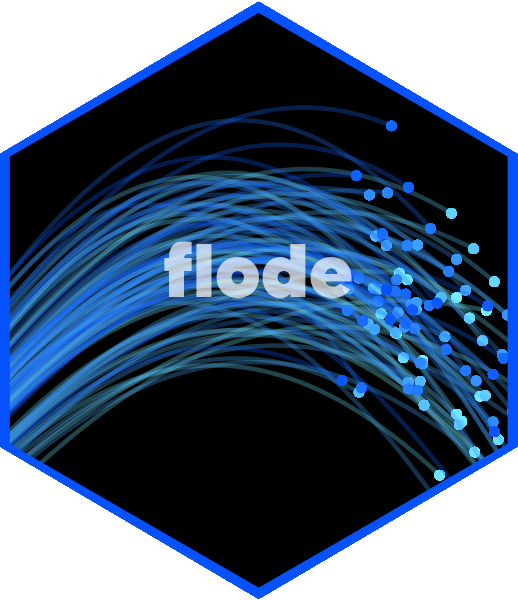
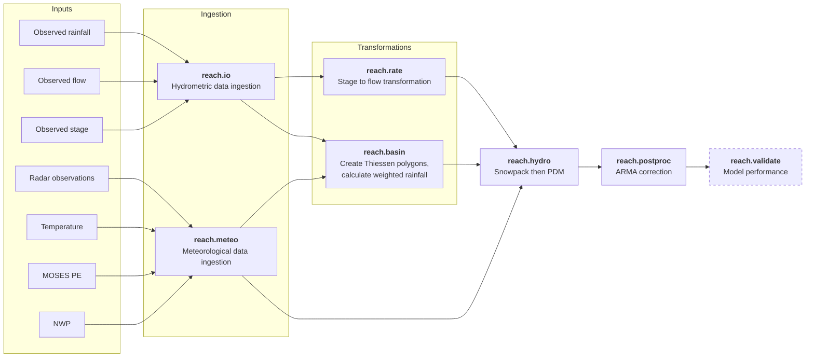
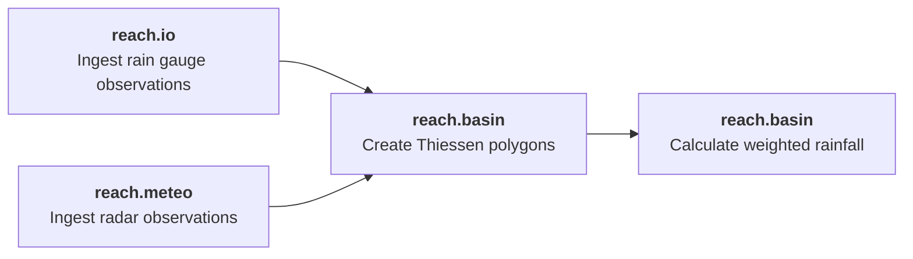
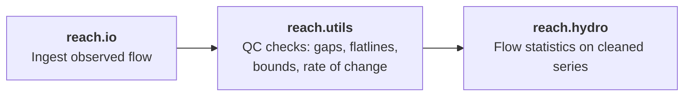
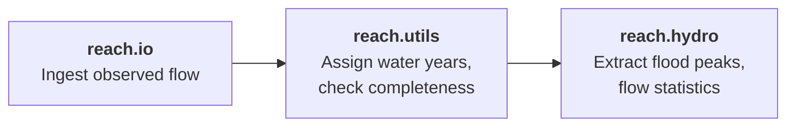
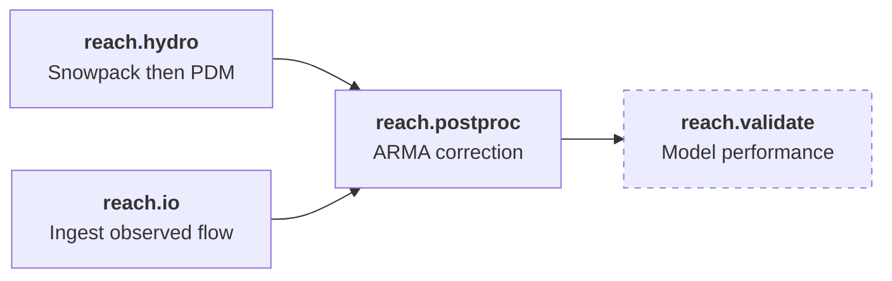

# flode 



<!-- badges: start -->
[](https://lifecycle.r-lib.org/articles/stages.html#experimental)
[](https://github.com/JonPayneEA/flode/actions/workflows/R-CMD-check.yaml)
<!-- badges: end -->

## Overview

`flode` is a meta-package for flood forecasting and hydrometric data analysis. Installing and loading `flode` gives you access to the complete suite of **reaches** sub-packages in a single call.

```r
library(flode)
```

---

## The reaches ecosystem

| Sub-package | Contents |
|---|---|
| [`reach.utils`](https://github.com/JonPayneEA/reach.utils) | Datetime helpers, config loading, logging |
| [`reach.io`](https://github.com/JonPayneEA/reach.io) | Hydrometric data ingestion: APIs, Gauge CSV, Parquet, netCDF read/write |
| [`reach.hydro`](https://github.com/JonPayneEA/reach.hydro) | Flow statistics, unit conversion, flood peaks; Snowpack and PDM rainfall-runoff modelling |
| [`reach.meteo`](https://github.com/JonPayneEA/reach.meteo) | Meteorological data ingestion (radar, temperature, MOSES PE, NWP) |
| [`reach.network`](https://github.com/JonPayneEA/reach.network) | River network tools |
| [`reach.postproc`](https://github.com/JonPayneEA/reach.postproc) | Forecast post-processing, e.g. ARMA correction |
| [`reach.rate`](https://github.com/JonPayneEA/reach.rate) | Stage-to-flow transformation (rating curves) |
| [`reach.basin`](https://github.com/JonPayneEA/reach.basin) | Thiessen polygons and catchment-weighted rainfall |
| [`reach.viz`](https://github.com/JonPayneEA/reach.viz) | `theme_flode()`, flow series and ensemble fan plots |

*Planned: `reach.ensemble` (quantile extraction, member weighting, exceedance probability) and `reach.validate` (NSE, KGE, PBIAS, RMSE) will be added once released.*

## Example workflows

How the reaches packages fit together. Dashed boxes are planned, not yet released.
List them in R with `flode_workflows()` and print one with `flode_workflow("name")`.

### Real-time forecasting run (`realtime`)


```mermaid
flowchart LR
  subgraph Inputs
    rain[Observed rainfall]
    flow[Observed flow]
    stage[Observed stage]
    radar[Radar observations]
    temp[Temperature]
    pe[MOSES PE]
    nwp[NWP]
  end

  subgraph Ingestion
    io["<b>reach.io</b><br/>Hydrometric data ingestion"]
    meteo["<b>reach.meteo</b><br/>Meteorological data ingestion"]
  end

  subgraph Transformations
    rate["<b>reach.rate</b><br/>Stage to flow transformation"]
    basin["<b>reach.basin</b><br/>Create Thiessen polygons,<br/>calculate weighted rainfall"]
  end

  hydro["<b>reach.hydro</b><br/>Snowpack then PDM"]
  postproc["<b>reach.postproc</b><br/>ARMA correction"]
  validate["<b>reach.validate</b><br/>Model performance"]

  rain & flow & stage --> io
  radar & temp & pe & nwp --> meteo
  io --> rate
  io --> basin
  meteo --> basin
  meteo --> hydro
  rate --> hydro
  basin --> hydro
  hydro --> postproc --> validate

  style validate stroke-dasharray: 5 5
```

### Catchment average rainfall (`catchment_rainfall`)


```mermaid
flowchart LR
  S1["<b>reach.io</b><br/>Ingest rain gauge observations"]
  S2["<b>reach.meteo</b><br/>Ingest radar observations"]
  S3["<b>reach.basin</b><br/>Create Thiessen polygons"]
  S4["<b>reach.basin</b><br/>Calculate weighted rainfall"]
  S1 --> S3
  S2 --> S3
  S3 --> S4
```

### Stage to flow conversion (`rating_conversion`)


```mermaid
flowchart LR
  S1["<b>reach.io</b><br/>Ingest observed stage"] --> S2["<b>reach.rate</b><br/>Transform stage to flow"] --> S3["<b>reach.hydro</b><br/>Calculate flow statistics"]
```

### Quality control of observed series (`data_qc`)


```mermaid
flowchart LR
  S1["<b>reach.io</b><br/>Ingest observed flow"] --> S2["<b>reach.utils</b><br/>QC checks: gaps, flatlines,<br/>bounds, rate of change"] --> S3["<b>reach.hydro</b><br/>Flow statistics on cleaned series"]
```

### Flood peaks and frequency (`flood_frequency`)


```mermaid
flowchart LR
  S1["<b>reach.io</b><br/>Ingest observed flow"] --> S2["<b>reach.utils</b><br/>Assign water years,<br/>check completeness"] --> S3["<b>reach.hydro</b><br/>Extract flood peaks,<br/>flow statistics"]
```

### Forecast correction and validation (`forecast_correction`)


```mermaid
flowchart LR
  S1["<b>reach.hydro</b><br/>Snowpack then PDM"] --> S3["<b>reach.postproc</b><br/>ARMA correction"] --> S4["<b>reach.validate</b><br/>Model performance"]
  S2["<b>reach.io</b><br/>Ingest observed flow"] --> S3
  style S4 stroke-dasharray: 5 5
```

---

## Helper functions

| Function | What it does |
|---|---|
| `flode_use_project()` | Scaffold a project with `reach.utils::create_project()` and a starter script for a chosen workflow |
| `flode_workflows()` / `flode_workflow()` | List the example workflows, or print one (optionally as Mermaid) |
| `flode_workflow_run()` / `flode_activities()` | Run a `pipeline.yml` through `reach.utils::run_pipeline()` (with `dry_run` checking), and list the activities the packages register |
| `flode_install()` | Install or update flode and all sub-packages from GitHub (uses `pak`, falls back to `remotes`) |
| `flode_sitrep()` | Compare installed versions with GitHub |
| `flode_snapshot()` / `flode_restore()` | Record the exact commit of each package for a run, and reinstall it later |
| `flode_doctor()` | Check R version, GitHub token, `pak`, installed packages and the project config |
| `flode_versions()` | Show installed versions |
| `flode_conflicts()` | Find function names shared between packages, or with base R |
| `flode_options()` | Get or set shared settings (`tz`, `data_dir`, `config`, `quiet`) |
| `flode_attach()` / `flode_detach()` | Attach or detach the sub-packages |

### Starting a project with `flode_use_project()`

`flode_use_project()` builds the project folders with
`reach.utils::create_project()` and, if you pick a workflow, adds a starter
script `R/00_workflow.R` listing that workflow's steps as comments to fill in.
Choose the workflow with the `workflow` argument. See all options with
`flode_workflows()`.

```r
# Real-time forecasting run (the default)
flode_use_project("~/projects/river-forecast")
flode_use_project("~/projects/river-forecast", workflow = "realtime")

# Catchment average rainfall
flode_use_project("~/projects/rainfall", workflow = "catchment_rainfall")

# Stage to flow conversion
flode_use_project("~/projects/rating", workflow = "rating_conversion")

# Quality control of observed series
flode_use_project("~/projects/qc", workflow = "data_qc")

# Flood peaks and frequency
flode_use_project("~/projects/peaks", workflow = "flood_frequency")

# Forecast correction and validation
flode_use_project("~/projects/correction", workflow = "forecast_correction")

# Folders and config only, with no starter script
flode_use_project("~/projects/blank", workflow = NULL)

# Add an author and skip the README
flode_use_project("~/projects/river-forecast", author = "Forecasting and Warning Team",
                  readme = FALSE)
```

Each project gets these folders from `reach.utils`:

```
river-forecast/
├── R/
│   └── 00_workflow.R      # starter script for the chosen workflow
├── config/
│   └── pipeline.yml       # read by reach.utils::load_config()
├── data/
│   ├── raw/
│   └── processed/
├── outputs/
├── logs/
├── tests/testthat/
├── .gitignore
└── README.qmd             # unless readme = FALSE
```

For example, `workflow = "data_qc"` writes this `R/00_workflow.R`:

```r
# Workflow: Quality control of observed series
# Check observed series before they are used for modelling.
# See flode::flode_workflow() for the full list of steps.

library(flode)

# Project settings live in config/pipeline.yml
cfg <- reach.utils::load_config("config/pipeline.yml")

# 1. reach.io: Ingest observed flow
# ...

# 2. reach.utils: Run QC checks (gaps, flatlines, bounds, rate of change)
# ...

# 3. reach.hydro: Calculate flow statistics on the cleaned series
# ...
```

Once the steps are filled in, run the project's `config/pipeline.yml` with
`flode_workflow_run()`. Use `dry_run = TRUE` first to check every activity is
registered.

---

## Installation

Install `flode` and all sub-packages from GitHub:

```r
# install.packages("remotes")
remotes::install_github("JonPayneEA/flode")

# or, with pak
pak::pak("JonPayneEA/flode")
```

Sub-packages can also be installed individually:

```r
remotes::install_github("JonPayneEA/reach.utils")
remotes::install_github("JonPayneEA/reach.io")
remotes::install_github("JonPayneEA/reach.hydro")
remotes::install_github("JonPayneEA/reach.meteo")
remotes::install_github("JonPayneEA/reach.network")
remotes::install_github("JonPayneEA/reach.postproc")
remotes::install_github("JonPayneEA/reach.rate")
remotes::install_github("JonPayneEA/reach.basin")
remotes::install_github("JonPayneEA/reach.viz")
```

---

## Usage

```r
library(flode)
#> ── Attaching reaches packages ──────────────────────── flode 0.2.0 ──
#> ✔ reach.utils    0.1.0     ✔ reach.rate      0.1.0
#> ✔ reach.io       0.1.0     ✔ reach.basin     0.1.0
#> ✔ reach.hydro    0.1.0     ✔ reach.viz       0.1.0
#> ✔ reach.meteo    0.1.0
#> ✔ reach.network  0.1.0
#> ✔ reach.postproc 0.1.0
```

### Check installed versions

```r
flode_versions()
```

### Update all sub-packages

```r
flode_update()
```

---

## Design principles

- **Consistent interfaces** — all reach packages follow the same bronze-schema data model
- **Pipeline-ready** — designed for operational EA Hydrometric Data Framework workflows
- **Parallel-first** — heavy I/O operations are parallelised where possible via `future` / `future.apply`
- **Tidy-compatible** — outputs are data.table friendly

---

## Contributing

This package is maintained by the Environment Agency Forecasting and Warning Team.
📧 forecasting@environment-agency.gov.uk

---

## License

MIT

---


